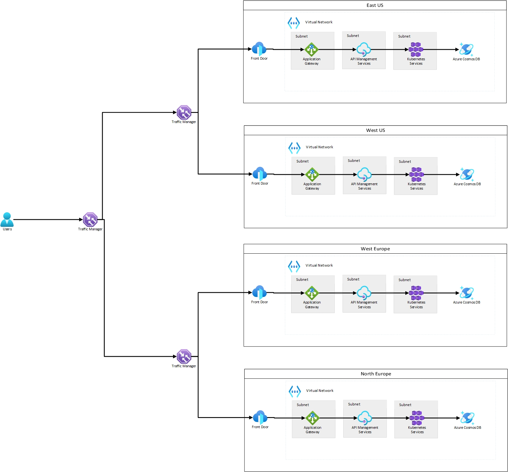

# ASP.NET Reference API

- [ASP.NET Reference API](#aspnet-reference-api)
  - [Overview](#overview)
    - [Operations](#operations)
  - [Architectural Decision Records](#architectural-decision-records)
    - [API standards](#api-standards)
    - [Code standards](#code-standards)
    - [Infrastructure standards](#infrastructure-standards)
    - [Testing standards](#testing-standards)
    - [Logging standards](#logging-standards)
    - [Correlation ID standards](#correlation-id-standards)
    - [Security standards](#security-standards)
    - [Scalability and high availability standards](#scalability-and-high-availability-standards)
      - [Active/active global high level design:](#activeactive-global-high-level-design)
      - [Other scalability considerations:](#other-scalability-considerations)
  - [Other considerations](#other-considerations)
  - [Upcoming improvements](#upcoming-improvements)
  - [Business Requirements for Reference API](#business-requirements-for-reference-api)
    - [Functional Requirements](#functional-requirements)
      - [Assumptions (requires clarification):](#assumptions-requires-clarification)
      - [Questions:](#questions)
    - [Non-functional requirements](#non-functional-requirements)

## Overview

This is a reference API using best practices I've found over the years. It's a sample API which receives notification of trades from authorised brokers and exposes the updated price to them.

### Operations

The OpenAPI Specification (Swagger) contains the latest API documentation at `/swagger/index.html`.

## Architectural Decision Records

Below is a list of architectural decisions made for this service.

### API standards
* Use POST to create resources and return 201 CREATED and a representation of the resource
* Use GET to get resources and return 200 OK
* Return 400 BAD REQUEST in cases where the client sends invalid data
* Use nouns rather than verbs in URLs
* Use plural nouns for resources
* Return descriptive errors for BAD REQUEST
* Use JSON for data transfer
* API Versioning and versioned Swagger - NB: Aim to reduce breaking changes and ensure as few versions of the API in production at any one time
* Use Open API Specification (Swagger)
* XML Comments added to controllers, requests and responses so that they are available in the Open API specification (Swagger) but would also be available if a developer portal is used

### Code standards

* .NET 6: 
  * Latest version of .NET
  * Supported as a Long Term Release till November 2024
  * Higher performance and uses latest C# 10
  * Global `using` statements chosen in preference to implicit `using` statements as these will not hide the fact that a class is referencing low level components such as System.Net.Http
  * File-scoped namespaces used to reduce the usage of horizontal space in .cs files
* SOLID principles
* DRY
* YAGNI
* Clean Architecture - Separation of application into layers to enable changing details such as the persistence or API layers without changing the domain or application layers
* Clean Code
* MediatR:
  * Good separation of concerns between classes e.g. logging and validation in separate classes
  * More decoupled controllers: controllers don't need to be changed when adding application services
* Fluent Validation - clear and easy to maintain and extend
* Reading large amounts of data from SQL in one go is not ideal however it was decided better to have the business logic in application code rather than in a stored procedure (in case the database technology is changed at a later date). Entity Framework Core 6 used to simplify development but also enables streaming of records from SQL to the application rather than pulling all records in one go and holding them in memory.

### Infrastructure standards

* API Management Developer Portal for API consumers to get documentation, test out the API in lower environments etc
* Deployment using Azure Pipelines (YAML), stored in the same repository as the code
* Azure Bicep can be used to deploy the infrastructure in the Azure Pipeline

### Testing standards

* Code written using Test Driven Development to ensure no over-engineering but ensure high test coverage
* Component Tests - These are high-level build-time tests which can be run without external systems. They test controller to a mocked out repository and test all required business functionality using Gherkin-like naming. The advantages of this approach are that the code is easier to refactor without breaking tests, therefore meaning it is more likely to be maintained well.
  * Shared `WebApplicationFactory`/`HttpClient` used for API tests to ensure fast tests
* Measuring capacity:
  * Automated Load testing - test with production load or higher
  * Automated Longevity testing - used to detect memory leaks
* Acceptance tests/End-to-end tests should be automated as part of the initial development

### Logging standards 
* Logging using Application Insights. Data to be stored in Log Analytics workspace so that data can be queried across multiple services in a distributed system.

### Correlation ID standards
* CorrelationId can be generated by the client and sent as an `X-Correlation-Id` header or generated by the API if not sent
* API returns `X-Correlation-Id` header in all responses (configured in middleware to prevent code re-use)
* `X-Correlation-Id` header value or generated value is stored in a `CorrelationIdService` which is injected as a Scoped service so that it is unique per HTTP request. This enables additional custom logging using the same CorrelationId value in repositories etc.

### Security standards

* TLS 1.2 end-to-end
* Broker Authentication using client certificates or OAuth2
* Authentication concerns kept out of the code and all authentication handled by API Management
* External connections from brokers connect to Azure Front Door then Application Gateway then API Management
* IP restrictions set on Azure Front Door to allow only broker IPs to connect
* DDOS protection: Azure Front Door provides DDOS protection however additional DDOS protection can be set on the VNET where the Application Gateway will be installed
* Secrets should not be stored in source control and Managed Identity should be used where possible. If not then Key Vault can be used to store secrets and the application can used Managed Identity to authenticate to Key Vault.
* Compute security: Kubernetes:
  * Container scanning
  * Network policies
  * Azure AD Authentication/RBAC for administration
  * End-to-end encryption using TLS 1.2
  * Outbound firewall prevents unauthorized outbound connections. Use NSG or Azure Firewall.

### Scalability and high availability standards

#### Active/active global high level design:

* A multi-region set up can be created with at least 2 Application Gateways and a zone-redundant API Management installation per region
* Azure Front Door is highly scalable and reliable
* To load balance between regions and direct users to their closest region, Traffic Manager can be used
* Compute scalability and availability can be provided by using an AKS cluster with multiple nodes. One of these should be in each required region.
* For multi-region set-ups where regions must be active/active then consider using CosmosDB instead of SQL as this allows for a multi-master setup where data can be written in multiple region without connecting cross-region which may cause performance issues
* Each container is run inside a pod in Kubernetes. Ensure that there are multiple replicas of the pod so this enables high availability and scalabilty. Ensure that pods are spread across multiple nodes in the Kubernetes cluster.
* Nesting of Traffic Manager routes users to the closest geographical region (e.g. United States) and then routes them to the highest performing Azure region e.g. Azure East US

#### Other scalability considerations:

* CQRS: Consider having a database specialized for writing trades and another one for reading share prices. Also consider caching for share prices or a background process that calculates the price every specified period and writes to a separate database. NB: Eventual consistency concerns (the price will not be exactly up to date).
* The share price repository could use caching to cache share prices. NB: Need to invalidate cached data and cached data will always be out of sync.
* Batch incoming requests to save trades (e.g. allow clients to send an `IEnumerable<SaveTradeRequest>`). This then allows saving multiple entries to the database in a single transaction.
* An alternative approach is to use an event driven architecture (e.g. with Azure Service Bus). Here, trades can be submitted using a queue (which allows for load levelling). Prices can then be calculated on a schedule and events published with the updated prices. Consumers can then keep their own cache of prices and use this when looking up prices.

## Other considerations

* Branching strategy
* Code approvals before release to production
* Change Advisory Board
* Document rollback plan
* Service Transition
* Ensure reproducible builds for application, test and infrastructure code using Azure Pipeline artifacts

## Upcoming improvements

* EditorConfig can be added to ensure code style in line with team requirements
* Add automated acceptance or automated end-to-end tests. SpecFlow?
* Create build and release pipelines, infrastructure as code etc
* Test concurrent connections to SQL have no issues
* Test using docker file
* Review memory usage when getting share price from SQL database - ensure that data is streamed rather than all data being pulled out into memory which could cause OutOfMemoryExceptions with large datasets
* Use batching for incoming requests to save trades and write them to the database in a single transaction

## Business Requirements for Reference API

### Functional Requirements

#### Assumptions (requires clarification):
* Max number of decimal places for stock price is 2
* Stock price must be greater than £0
* Max number of decimal places for stock count is 2
* Stock count must be greater than 0
* Max ticker symbol length is 20
* Ticker symbol cannot be whitespace or empty

#### Questions:
* What is the BrokerId format?
* What are the BrokerId validations (length etc)?
* What is the max count of shares?
* What is the max price of a share?

### Non-functional requirements

* How many requests/second or max number of concurrent requests required when saving trades?
* How many requests/second or max number of concurrent requests required when retrieving share prices?
* What are the requirements for logging and reporting?
* How much data should be stored/any requirements to purge data?
* Security requirements? (Assumed TLS 1.2, authentication, IP restriction, DDOS protection)
* Required response time for requests under load?
* Process for onboarding new brokers and removing old brokers?
* Authentication for brokers?
* Providing documentation to brokers?